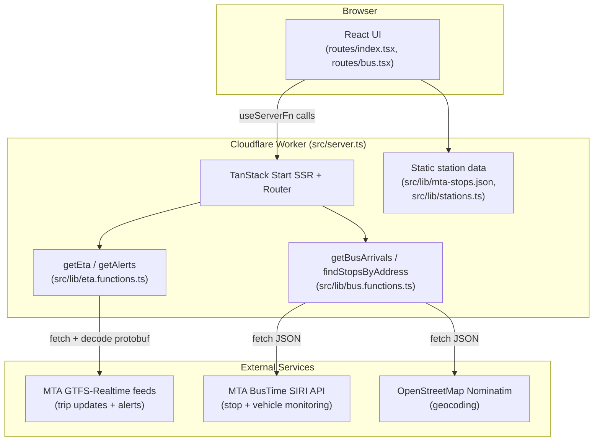

# MTA Real-Time NYC Transit Tracker

A real-time subway and bus arrival tracker for the New York City MTA, built as a TanStack Start web app deployed to Cloudflare Workers.

## Overview

This project is a single-page transit dashboard that lets a rider look up live subway and bus arrival times anywhere in New York City. It pulls directly from the MTA's public real-time data feeds (GTFS-Realtime for subways, SIRI for buses) and renders a countdown-clock-style board similar to the digital signage found on subway platforms.

It solves the everyday problem of not knowing when the next train or bus will actually show up — rather than relying on scheduled timetables, it shows live, second-by-second predictions sourced straight from MTA vehicle data. It's intended for NYC transit riders who want a fast, no-clutter way to check arrivals from a phone or desktop browser, and it doubles as a portfolio example of building a real-time data application on TanStack Start with a Cloudflare Workers backend.

## Features

- **Subway station search** — fuzzy, typo-tolerant search across all NYC subway stations, with matching line bullets shown inline (`src/lib/stations.ts`)
- **Live subway arrivals** — real-time countdown times per direction (uptown/downtown or line-specific labels like "to Jamaica"), pulled from the MTA's GTFS-Realtime feeds
- **Subway line filtering** — filter the arrival board down to a single train line serving the selected station, or view all lines at once
- **Both-directions toggle** — show both directions or collapse to the direction with more upcoming trains
- **Subway service alerts** — active GTFS-Realtime service alerts for the selected station's lines, shown as dismissible banners
- **Geolocation-based nearby stations** — uses the browser Geolocation API to find and rank the closest subway stations by haversine distance
- **Bus arrival lookup by route + stop** — enter a bus route (including Select Bus Service `+` routes) and a stop to see live SIRI-based arrival predictions
- **Address/intersection-based stop finder** — geocodes a typed address or intersection via OpenStreetMap Nominatim and looks up nearby MTA bus stops
- **Live bus vehicle list** — shows currently active buses on the selected route (location, progress status, occupancy) via SIRI vehicle monitoring
- **Auto-refreshing data** — both the subway and bus views poll every 30 seconds, with a "last updated Xs ago" indicator and a countdown to the next refresh
- **Loading, error, and empty states** — explicit UI states for in-flight requests, feed/API failures, and "no trains/buses found" results
- **Custom error page** — a branded fallback HTML page is served if server-side rendering fails
- **Responsive, mobile-first UI** — a single-column layout built with Tailwind CSS that works from phone to desktop

## Demo

No live deployment URL or screenshots are currently included in this repository. *(Add a deployed link and/or screenshots here once available.)*

## Screenshots

No screenshots are currently included in this repository. *(Add screenshots here once available.)*

## Tech Stack

| Technology | Role |
| --- | --- |
| **TypeScript** | Primary language across the entire app (client, server functions, config) |
| **React 19** | UI layer |
| **TanStack Start** | Full-stack React framework — file-based routing, SSR, and server functions (`createServerFn`) |
| **TanStack Router** | Client/server routing (`src/routes/`, generated `routeTree.gen.ts`) |
| **TanStack Query** | Query client wired into the router context (`src/router.tsx`) |
| **Vite** | Build tool and dev server, configured via `@lovable.dev/vite-tanstack-config` |
| **Tailwind CSS 4** | Utility-first styling (`src/styles.css`, `@tailwindcss/vite`) |
| **Radix UI + shadcn/ui-style components** | Pre-built accessible UI primitives in `src/components/ui/` (accordion, dialog, select, etc.), configured via `components.json` |
| **gtfs-realtime-bindings** | Decodes MTA's protobuf-encoded GTFS-Realtime feeds (trip updates and service alerts) |
| **Zod** | Runtime validation of server function inputs (e.g. `getEta`, `getAlerts`) |
| **Cloudflare Workers (Wrangler)** | Deployment target — `wrangler.jsonc` points to `src/server.ts` as the Worker entry, built via `@cloudflare/vite-plugin` |
| **MTA GTFS-Realtime feeds** | Public subway trip-update and service-alert data (no API key required) |
| **MTA BusTime SIRI API** | Real-time bus stop/vehicle monitoring (requires an API key) |
| **OpenStreetMap Nominatim** | Free geocoding used to resolve a typed address/intersection into coordinates for bus stop lookup |
| **ESLint + Prettier** | Linting and formatting (`eslint.config.js`, `.prettierrc`) |

## Architecture



- **Frontend**: React components under `src/routes/` (`index.tsx` for subway, `bus.tsx` for bus) render the search UI, filters, and arrival boards. Shared UI primitives live in `src/components/ui/`.
- **Server functions**: TanStack Start's `createServerFn` is used to define server-only handlers (`getEta`, `getAlerts`, `getBusArrivals`, `findStopsByAddress`) that the client calls via `useServerFn`, without needing a separate REST API layer.
- **Worker entry**: `src/server.ts` wraps TanStack Start's generated server entry, normalizing SSR errors into a branded HTML error page (`src/lib/error-page.ts`) using an out-of-band error capture utility (`src/lib/error-capture.ts`).
- **Static station data**: `src/lib/mta-stops.json` contains subway station IDs, names, coordinates, and serving lines, used for client-side search and nearest-station calculations in `src/lib/stations.ts`.
- **External feeds**: All real-time data (subway feeds, bus SIRI API, geocoding) is fetched server-side inside the server functions — the browser never talks to MTA or Nominatim directly.

## How It Works

**Subway flow:**
1. The user types a station name into the search box; `searchStations` scores and ranks matches from the local station list.
2. Selecting a station (or picking a nearby one from geolocation results) triggers `getEta`, a server function that determines which GTFS-Realtime feed(s) cover the station's lines.
3. The server fetches and decodes the relevant protobuf feed(s) with `gtfs-realtime-bindings`, filters trip updates to the selected stop and lines, and computes minutes-until-arrival and destination for each upcoming train.
4. In parallel, `getAlerts` fetches the subway service-alerts feed and returns any active alerts for the station's lines.
5. The frontend groups arrivals by direction (N/S), sorts by arrival time, and renders the countdown board with live-updating "seconds ago" and refresh-countdown indicators. Data is refetched automatically every 30 seconds.

**Bus flow:**
1. The user enters a bus route number and either selects a nearby stop via "Find stops" (address/intersection geocoding) or already knows a stop ID.
2. `findStopsByAddress` geocodes the typed address via Nominatim, then queries the MTA BusTime `stops-for-location` endpoint to list nearby stops, merging duplicate stops that share a name (e.g. both directions of an intersection).
3. Submitting the form calls `getBusArrivals`, which queries the SIRI `stop-monitoring` endpoint (for arrival predictions at the chosen stop) and `vehicle-monitoring` endpoint (for all active vehicles on the route) in parallel.
4. Results are grouped by direction, sorted by ETA, and rendered as arrival cards plus a live vehicle list. This view also auto-refreshes every 30 seconds.

## APIs and Data Sources

| Source | Purpose | Used in | Credentials |
| --- | --- | --- | --- |
| **MTA GTFS-Realtime feeds** (`api-endpoint.mta.info/Dataservice/mtagtfsfeeds/...`) | Protobuf-encoded real-time subway trip updates (per line group: `gtfs`, `gtfs-ace`, `gtfs-bdfm`, `gtfs-g`, `gtfs-jz`, `gtfs-nqrw`, `gtfs-l`, `gtfs-si`) | `src/lib/eta.functions.ts` (`getEta`) | None required |
| **MTA GTFS-Realtime subway alerts feed** (`.../camsys%2Fsubway-alerts`) | Active service alerts (header, description, affected routes) | `src/lib/eta.functions.ts` (`getAlerts`) | None required |
| **MTA BusTime SIRI API** (`bustime.mta.info/api/siri/...`) | `stop-monitoring` (arrival predictions per stop) and `vehicle-monitoring` (live vehicle positions/status per route) | `src/lib/bus.functions.ts` (`getBusArrivals`) | Requires `MTA_BUS_API_KEY` |
| **MTA BusTime "Where" API** (`bustime.mta.info/api/where/stops-for-location.json`) | Bus stops near a given lat/lon | `src/lib/bus.functions.ts` (`findStopsByAddress`) | Requires `MTA_BUS_API_KEY` |
| **OpenStreetMap Nominatim** (`nominatim.openstreetmap.org/search`) | Free geocoding of a user-typed address/intersection into coordinates | `src/lib/bus.functions.ts` (`findStopsByAddress`) | None required |
| **Static GTFS station list** (`src/lib/mta-stops.json`) | Bundled subway station IDs, names, coordinates, and serving lines used for search/nearby lookups | `src/lib/stations.ts` | N/A (local data file) |

## Project Structure

```text
mta-real-time/
├── public/
│   └── favicon.ico
├── src/
│   ├── components/
│   │   ├── NavBar.tsx          # Subway/Bus nav links
│   │   └── ui/                 # Radix/shadcn-style UI primitives
│   ├── hooks/
│   │   └── use-mobile.tsx
│   ├── lib/
│   │   ├── bus.functions.ts    # getBusArrivals, findStopsByAddress (server functions)
│   │   ├── eta.functions.ts    # getEta, getAlerts (server functions)
│   │   ├── stations.ts         # client-safe station search/nearby helpers
│   │   ├── mta-stops.json      # static subway station data
│   │   ├── error-capture.ts    # out-of-band SSR error capture
│   │   ├── error-page.ts       # branded HTML error fallback
│   │   └── utils.ts
│   ├── routes/
│   │   ├── __root.tsx          # root layout, head tags, error/404 boundaries
│   │   ├── index.tsx           # subway tracker page
│   │   └── bus.tsx              # bus tracker page
│   ├── routeTree.gen.ts        # auto-generated by TanStack Router
│   ├── router.tsx               # router + query client setup
│   ├── server.ts                 # Cloudflare Worker entry (SSR error wrapping)
│   ├── start.ts                  # TanStack Start instance + request middleware
│   └── styles.css
├── components.json               # shadcn/ui config
├── eslint.config.js
├── vite.config.ts                 # Lovable TanStack Vite config wrapper
├── wrangler.jsonc                 # Cloudflare Worker config
├── package.json
└── tsconfig.json
```

## Prerequisites

- **Node.js** and a package manager (the repo includes both `package-lock.json` and `bun.lock`, so either `npm` or `bun` will work)
- An **MTA Bus Time API key** (free, from the [MTA Bus Time developer portal](https://bustime.mta.info/wiki/Developers/Index)) — required only for the bus-tracking page; the subway page works without it

No specific Node.js version is pinned in this repository.

## Installation

```bash
git clone https://github.com/katkay1997/mta-real-time.git
cd mta-real-time
npm install
```

## Environment Variables

| Variable | Description | Required |
| --- | --- | --- |
| `MTA_BUS_API_KEY` | API key for the MTA Bus Time SIRI/"Where" API, used by the bus arrivals and stop-lookup server functions | Yes, for bus tracking (`/bus`). The subway tracker (`/`) does not require it. |

There is no `.env.example` file in this repository. For local development, set the variable via a `.env` file or, for Cloudflare/Wrangler-based local dev, a `.dev.vars` file (both are already excluded via `.gitignore`). Without this variable set, the bus server functions return an explicit "Server is missing `MTA_BUS_API_KEY`" error instead of failing silently.

## Running the Application

Start the development server:

```bash
npm run dev
```

Vite will print the local URL to open (Vite's default is `http://localhost:5173`, though the Lovable Vite config wrapper may adjust the port/host).

## Available Scripts

| Command | Description |
| --- | --- |
| `npm run dev` | Starts the Vite development server |
| `npm run build` | Builds the app for production |
| `npm run build:dev` | Builds the app in development mode |
| `npm run preview` | Serves the production build locally for preview |
| `npm run lint` | Runs ESLint over the project |
| `npm run format` | Formats the codebase with Prettier |

## Real-Time Transit Data

- **Subway**: `getEta` fetches the MTA's GTFS-Realtime protobuf feed(s) covering the requested station's lines, decodes them with `gtfs-realtime-bindings`, and filters trip updates down to the specific stop and requested lines. Arrival minutes are computed from each trip's predicted arrival/departure timestamp relative to the current server time, and results beyond 90 minutes out are discarded. Destinations are derived from the last stop in each trip's stop-time-update sequence (falling back to a static uptown/downtown label per line if unavailable).
- **Service alerts**: `getAlerts` fetches the MTA's subway alerts GTFS-Realtime feed, filters to alerts whose active period currently includes "now" and whose informed routes match the station's lines, and returns up to 5.
- **Bus**: `getBusArrivals` queries the SIRI `stop-monitoring` endpoint for each selected stop ID and the `vehicle-monitoring` endpoint for the route, in parallel, then merges and sorts the results by ETA.
- **Refresh cadence**: Both the subway and bus views poll their respective server functions every 30 seconds (`REFRESH_SECONDS = 30` in `routes/index.tsx` and `routes/bus.tsx`), with a visible "Updated Xs ago" indicator and a "Refresh in Xs" countdown. Bus requests are cancelled via `AbortController` if a new request starts before the previous one resolves.
- **Caching**: There is no server-side response caching — each refresh re-fetches and re-decodes the relevant feed(s) directly from MTA.
- **Limitations**: Real-time accuracy is entirely dependent on the upstream MTA feeds; if a feed is degraded, delayed, or returns malformed data, the app reflects whatever the feed reports.

## Error Handling and Edge Cases

- **Missing station**: `getEta` returns a "Station not found" error if the requested stop ID isn't in the static station list.
- **Unsupported lines**: If none of the requested lines have a known feed mapping, `getEta` returns a "No supported lines for this station" error.
- **Feed fetch failures**: Both `getEta` and `getAlerts` catch fetch/decoding errors and surface a descriptive error string to the UI rather than throwing.
- **Missing API key**: `getBusArrivals` and `findStopsByAddress` short-circuit with an explicit "Server is missing `MTA_BUS_API_KEY`" error if the key isn't configured.
- **Invalid bus input**: The bus route and stop ID are validated server-side (route must match a letter+number pattern, stop IDs must be numeric); invalid input throws a validation error before any external request is made.
- **Geocoding failures**: `findStopsByAddress` returns distinct errors for a failed geocoding request, an address that can't be resolved, or a stop lookup that fails after geocoding succeeds.
- **No stops/no results**: The bus stop finder reports "No bus stops found near this address" when Nominatim resolves an address but no stops are nearby; the arrivals board shows "No active buses found for this stop" when a valid stop returns zero live vehicles.
- **In-flight request cancellation**: Bus arrival requests are aborted (via `AbortController`) if the user submits a new search before the previous fetch completes.
- **Loading/empty states**: Both pages show a pulsing status indicator while loading and an explicit "No upcoming trains found" / "No active buses found" message when a request succeeds but returns no results.
- **SSR failures**: `src/server.ts` and `src/start.ts` catch server-rendering errors (including cases where the underlying framework swallows a thrown error into a generic 500) and serve a branded static error page instead of a blank failure.
- **404 handling**: `routes/__root.tsx` defines a custom "Page not found" component for unmatched routes.

## Responsive Design / User Experience

- Single-column, mobile-first layout (`max-w-2xl` centered container) that scales up cleanly to desktop widths, built entirely with Tailwind CSS utility classes.
- Persistent top navigation between the Subway and Bus pages (`src/components/NavBar.tsx`), with active-route highlighting.
- Autocomplete-style station search with a dropdown of matching stations and their line bullets.
- Colored line "bullet" badges matching official MTA line colors for quick visual scanning.
- Color-coded ETA text (red under 2 minutes, yellow 2–5 minutes, green beyond 5 minutes).
- Dismissible service alert banners.
- Live status indicators: an animated pulse dot reflecting loading state, "updated Xs ago" text, and a refresh countdown.
- Geolocation-gated "nearby stations" panel, only requesting the browser's location permission when the user opts in.
- Accessible labels on key interactive elements (e.g. `aria-label` on the station search input and line filter buttons).

## Deployment

The project is configured for deployment to **Cloudflare Workers**:

- `wrangler.jsonc` sets the Worker entry to `src/server.ts` and enables the `nodejs_compat` compatibility flag.
- The build is produced via `@cloudflare/vite-plugin`, which is wired in through `@lovable.dev/vite-tanstack-config` (see the comment in `vite.config.ts`).
- No CI/CD pipeline (e.g. GitHub Actions) or other hosting configuration is present in this repository, so deployment is performed via Wrangler tooling directly.

## Known Limitations

- Real-time accuracy is fully dependent on the upstream MTA GTFS-Realtime and SIRI feeds; outages or malformed data on MTA's side propagate directly to the app.
- Bus tracking requires a valid `MTA_BUS_API_KEY`; without one, the entire `/bus` page returns a configuration error instead of data.
- There is no server-side caching, so every 30-second refresh re-fetches and re-decodes the relevant feed(s) from MTA — response time depends on MTA's feed latency.
- Geocoding relies on the free OpenStreetMap Nominatim service, which has its own usage policies and rate limits and may not resolve ambiguous or informal addresses.
- Geolocation-based features ("Use my location", nearby stations) require the user to grant browser location permission and will simply not appear if it's denied or unsupported.
- Subway line-to-feed mapping and direction labels are hardcoded per line in `src/lib/eta.functions.ts`; any MTA route restructuring would require updating these maps.

## Future Improvements

No TODO/FIXME comments or documented roadmap currently exist in the repository. Potential areas for future work based on the current implementation include:

- Server-side caching of decoded GTFS-Realtime feeds to reduce redundant parsing across concurrent requests.
- A saved-stations or favorites list for quicker repeat lookups.
- Direct stop-ID entry for the bus page as an alternative to address-based lookup.
- Automated tests around the server functions' feed-parsing and error-handling logic.

## Technical Highlights

- Full-stack TypeScript with TanStack Start's `createServerFn`, avoiding a separate backend service while still keeping data fetching and API keys server-side only.
- Binary protobuf decoding of MTA's GTFS-Realtime feeds using `gtfs-realtime-bindings`, including handling of 64-bit `Long` timestamp values.
- Parallelized data fetching (`Promise.all`) for both multi-feed subway lookups and combined SIRI stop/vehicle monitoring queries.
- Client-side fuzzy search and haversine-distance nearest-station calculation over a bundled static dataset.
- Request cancellation via `AbortController` to avoid race conditions between overlapping bus arrival requests.
- Defensive SSR error handling at two layers (TanStack Start middleware and the raw Worker `fetch` handler) to guarantee a branded error page instead of a raw framework error.
- Deployment to Cloudflare's edge runtime via Wrangler with Node.js compatibility enabled.

## Development Notes

- This project was scaffolded and is maintained using **Lovable** (`@lovable.dev/vite-tanstack-config`); `vite.config.ts` contains an explicit warning not to manually add plugins (TanStack Start, React, Tailwind, path aliases, etc.) that the Lovable config already provides, to avoid duplicate-plugin errors.
- `src/routeTree.gen.ts` is auto-generated by TanStack Router and excluded from Prettier formatting (see `.prettierignore`) — it should not be hand-edited.
- The `wrangler.jsonc` `main` field alone is not sufficient for the Cloudflare build; `vite.config.ts` explicitly redirects TanStack Start's server entry to `src/server.ts` so the custom SSR error wrapper is used.
- Bus route codes are normalized server-side to detect Select Bus Service routes (trailing "SBS" or "+") and to route MTA Bus Company (MTABC) routes — e.g. certain Queens/Bronx/Staten Island express routes — to a different `LineRef` prefix than standard NYCT routes.

## License

No license file is currently present in this repository, so no license is specified.

## Author

Repository owner: [katkay1997](https://github.com/katkay1997) (per the repository's `origin` remote).
